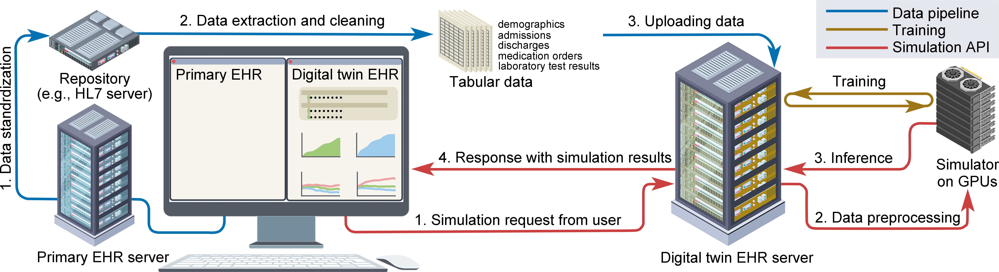

Watcher Documentation
======================

Watcher is a generative AI model that simulates patient timelines.
It enables computational modeling of patient trajectories.
These capabilities support downstream applications such as personalized medicine, in-silico clinical trials, and counterfactual predictions.
Or, it can simply synthesize large-scale synthetic patient databases.

Watcher serves as the backend simulator in our digital-twin framework (see below). However, it can also be used independently as a stand-alone simulation engine for various applications.

Start with 👉 :doc:`Tutorial <tutorial>`

GitHub 👉 https://github.com/yuakagi/Watcher

Digital-Twin EHR System
=======================
Watcher serves as the backend simulator in our digital-twin framework (Figure):

This system enables the simulation of patient trajectories based on real-world clinical data, allowing opportunities for possible downstream applications such as personalized medicine, in-silico clinical trials and more.
It consists of three components:

1. **AI model** `[GitHub] <https://github.com/yuakagi/Watcher>`_: A generative model that simulates patient timelines.  (👈 This package you are currently reading.)
2. **Digital-twin EHR** `[GitHub] <https://github.com/yuakagi/project_twin>`_: A web-based, AI-powered EHR that interacts with the model and visualizes simulation results.  
3. **Data pipeline**: A data pipeline that supplies real-world clinical data to the data server.  (Use `our data pipeline <https://github.com/yuakagi/ssmixtools>`_ or,use **clinical data you prepared yourself**)

To use the full digital-twin system, please follow these steps:

   Step 1: Prepare your clinical data (please see the note below)
      - Required clinical data are defined in :ref:`clinical_records`
      - You can use your own clinical data or publicly available datasets.
      - Or, for Japanese hospitals, you can use `our data pipeline <https://github.com/yuakagi/ssmixtools>`_ to collect and clean clinical data.

   Step 2: Upload clinical data to database (Use Watcher package)
      - Watcher package provides a docker container for PostgreSQL database.
      - You can upload your clinical data to the database using the package.

   Step 3: Train the AI model (Use Watcher package)
      - Train (pretrain & fine-tune) the AI model using the Watcher package following the :doc:`tutorial <tutorial>`.

   Step 4: Launch the simulation API server (Use Watcher package)
      - The Watcher package provides a simulation API server that runs the AI model (gunicorn + Flask).
      - This will be the API server that the digital-twin EHR system will communicate with.
      - Launch the server following the :doc:`tutorial <tutorial>`.

   Step 5: Launch the digital-twin EHR system (Use project_twin)
      - project_twin is a Django based web application that provides a user interface for the simulation API.
      - Clone the repository and set proper environment variables to connect to the simulation API server.
      - Then, run the Django server and access the web application.

.. note::
   - Although we provide a data pipeline for the Japanese HL7 standard only, **users outside Japan are fully supported**.
   - The digital-twin system can run independently of location, as long as clinical data are structured into relational tables following our schema (see :ref:`clinical_records`).
   - Prepare your own datasets or publicly available clinical datasets, and preprocess them to match the schema used in this package.
   - For Japanese users, our data pipeline can conveniently collect and clean clinical data, but its use is not mandatory.

.. toctree::
   :maxdepth: 6
   :caption: Watcher API:

   generated/watcher
   table_definitions/tables
